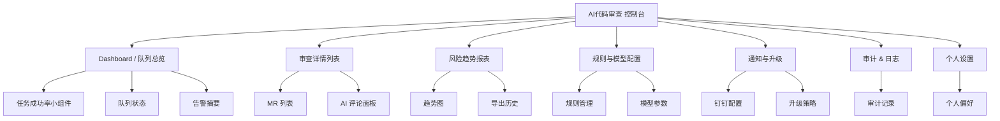
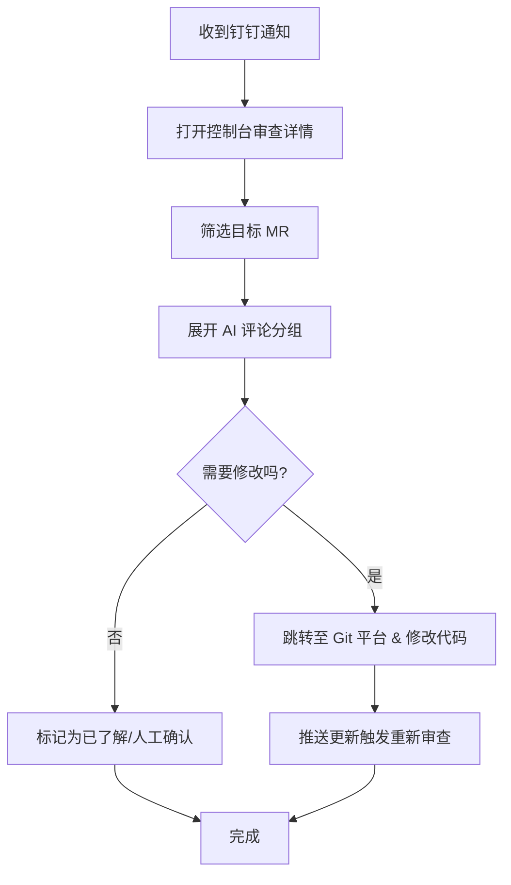
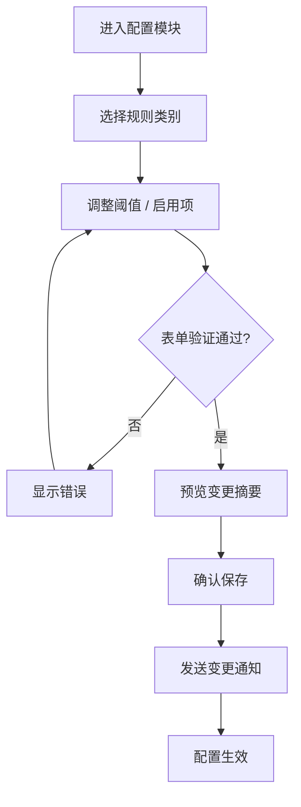
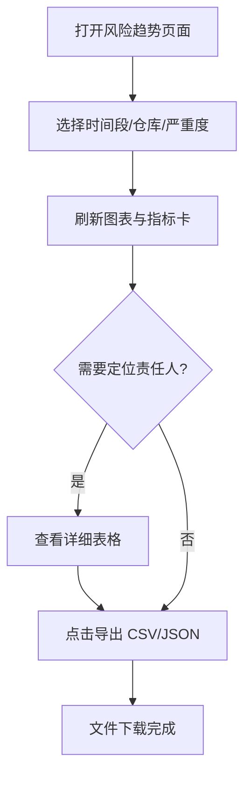

# AI代码审查 UI/UX Specification

## Introduction
This document defines the user experience goals, information architecture, user flows, and visual design specifications for AI代码审查's user interface. It serves as the foundation for visual design and frontend development, ensuring a cohesive and user-centered experience.

### Overall UX Goals & Principles

#### Target User Personas
- **核心提交者（Core Developer）：** 频繁推送代码的工程师，需要在 MR 提交后 5 分钟内收到清晰、可执行的反馈。
- **资深审查者（Reviewer Lead）：** 负责质量闸口的高级工程师，关注阻断级问题、建议的可信度与追踪性。
- **工程经理 / 运维（Quality Manager & Ops）：** 对团队风险趋势和告警升级负责，需要仪表板、报表与通知配置，确保 SLA。

#### Usability Goals
- 首次使用的开发者可在 5 分钟内理解并响应 AI 评论。
- 阻断级问题一屏可见且支持直接跳转至代码位置。
- 管理层可在仪表板 1 分钟内定位风险趋势、责任人和告警记录。
- 配置/通知表单提供即时验证，避免误触或漏填。

#### Design Principles
1. **信息分层** — 将阻断级信息置顶，辅助信息按优先级渐进呈现。
2. **即时反馈** — 每次交互都提供状态提示，评论发送、配置保存需实时确认。
3. **一致模式** — 评论模板、颜色、图标在所有界面保持一致，降低认知负担。
4. **数据可溯源** — 所有指标、报表与通知均附带来源与上下文链接。
5. **可操作透明** — 各项操作提供“为什么”“下一步”说明，引导用户完成闭环。

### Change Log
| Date       | Version | Description          | Author |
| ---------- | ------- | -------------------- | ------ |
| 2025-10-18 | 0.1     | 初版 UI/UX 规格草稿 | Sally  |

## Information Architecture (IA)

### Site Map / Screen Inventory

### Navigation Structure
**Primary Navigation:** 左侧固定侧边栏，包含 Dashboard、审查详情、风险报表、配置、通知、审计、设置；使用图标 + 文本。

**Secondary Navigation:** 顶部工具栏用于环境切换（测试/预发/生产）、时间范围选择、搜索仓库；在子页面内提供标签页（如配置页的规则/模型）。

**Breadcrumb Strategy:** Breadcrumbs 显示在主内容顶部，格式 “审查详情 / `<仓库>` / MR !123”；帮助用户回到上一层列表。

## User Flows

### Flow 1 – 审查结果回查
**User Goal:** 开发者查看并处理 AI 评论。

**Entry Points:** 钉钉通知链接；Dashboard “最新阻断”列表。

**Success Criteria:** 所有阻断项被标记处理或留有备注，并触发重新审查。

#### Flow Diagram

#### Edge Cases & Error Handling
- 评论加载失败：显示占位骨架与重试按钮。
- LLM 结果缺失：展示规则结果并提示人工复核。
- 权限不足：引导用户联系仓库管理员。

**Notes:** 在评论卡片上提供“复制建议”与“查看证据”动作，帮助开发者快速响应。

---

### Flow 2 – 配置审查规则
**User Goal:** 审查工程师调整检测类别与阈值。

**Entry Points:** Dashboard 告警提示、侧边导航“配置”。

**Success Criteria:** 新配置即时生效，生成审计记录并通知相关人。

#### Flow Diagram

#### Edge Cases & Error Handling
- 变更冲突：若他人同时修改，提示刷新并显示差异。
- API 超时：保留本地草稿并允许稍后重试。

**Notes:** 保存后在顶部显示“生效时间 + 回滚按钮”，便于快速撤销。

---

### Flow 3 – 管理风险趋势与导出
**User Goal:** 工程经理评估团队风险、导出报表。

**Entry Points:** 每周例会前访问 Dashboard 或链接。

**Success Criteria:** 成功筛选时间范围，导出 CSV/JSON，并捕获核心指标。

#### Flow Diagram

#### Edge Cases & Error Handling
- 数据尚未刷新：显示上次刷新时间和“立即刷新”按钮。
- 导出失败：保留重试入口并提示联系运维。

**Notes:** 导出按钮应持续可见，并提供格式切换（CSV/JSON）及描述字段列表。

## Wireframes & Mockups
- **Primary Design Files:** 将在 Figma 项目《AI代码审查 UX》（待创建）中维护。  

### Key Screen Layouts

#### Dashboard
**Purpose:** 提供队列与风险概览、突出的阻断项。

**Key Elements:**
- KPI 卡片（任务成功率、平均耗时、阻断总数）
- 实时队列条形图（正常/失败/超时）
- “最新阻断”列表 + 快速操作

**Interaction Notes:** KPI 卡点击跳转相关页面；队列图支持 Hover 显示详细数据。

**Design File Reference:** Figma: `Dashboard_V1`（占位）

#### 审查详情面板
**Purpose:** 展示单个 MR 的 AI 评论与证据。

**Key Elements:**
- MR 顶部摘要（仓库、作者、状态、阻断数）
- 评论列表（按严重度分组、引用代码片段、建议）
- “标记已处理”与“请求人工复核”按钮

**Interaction Notes:** 评论卡支持折叠、复制建议、跳转至 Git 平台；状态栏显示重新审查倒计时。

**Design File Reference:** Figma: `Review_Detail_V1`

#### 风险趋势报表
**Purpose:** 呈现按时间、仓库、责任人维度的风险趋势。

**Key Elements:**
- 时间范围筛选器、仓库多选、严重度 filter
- 折线/柱状图切换
- 详细数据表格、导出操作区

**Interaction Notes:** 图表 hover 显示数据点；表格列支持排序、导出选项固定在顶部。

**Design File Reference:** Figma: `Risk_Report_V1`

## Component Library / Design System

**Design System Approach:** 以 Ant Design 组件库为基础，结合企业配色与自定义组件，形成轻量 Design Tokens。在 `packages/ui-components` 中维护二次封装。

### Core Components

#### 审查状态徽章
**Purpose:** 标识阻断/警告/提示/确认状态。

**Variants:** 阻断（红色）、警告（橙色）、提示（蓝色）、确认（绿色）。

**States:** 默认、Hover（显示说明 Tooltip）、Disabled（灰显）。

**Usage Guidelines:** 仅用于审查相关场景；文字简洁（最多 2 词），避免与 Alert 组件混用。

#### 评论卡片
**Purpose:** 展示 AI 建议、引用代码、操作按钮。

**Variants:** 含代码片段 / 无代码；含建议 diff / 无建议。

**States:** 展开、折叠、处理中（发送请求）、处理完成。

**Usage Guidelines:** 顶部显示严重度与来源；正文最大宽度 1200px，支持 Markdown。

#### KPI 指标卡
**Purpose:** Dashboards 上显示关键指标。

**Variants:** 单值卡、带趋势箭头卡。

**States:** 正常、警戒（背景淡黄）、告警（背景淡红）。

**Usage Guidelines:** 更新频率在卡片角落标注；支持点击跳转。

## Branding & Style Guide

### Visual Identity
**Brand Guidelines:** 参考企业开发者平台品牌手册（链接待补）。若无，则使用企业蓝 (#0052CC) 为主色调。

### Color Palette
| Color Type | Hex Code | Usage |
| ---------- | -------- | ----- |
| Primary    | #0052CC  | 主要按钮、链接、导航高亮 |
| Secondary  | #0B1F33  | 背景深色、侧边栏 |
| Accent     | #38BDF8  | 次级强调、选择态 |
| Success    | #22C55E  | Positive feedback, confirmations |
| Warning    | #F59E0B  | Cautions, important notices |
| Error      | #EF4444  | Errors, destructive actions |
| Neutral    | #F5F5F5 / #D1D5DB / #111827 | Text, borders, backgrounds |

### Typography
- **Primary:** Inter
- **Secondary:** Noto Sans SC
- **Monospace:** JetBrains Mono

| Element | Size | Weight | Line Height |
| ------- | ---- | ------ | ----------- |
| H1      | 32px | 600    | 40px        |
| H2      | 24px | 600    | 32px        |
| H3      | 20px | 600    | 28px        |
| Body    | 16px | 400    | 24px        |
| Small   | 14px | 400    | 20px        |

### Iconography
**Icon Library:** Ant Design Icons + 企业自定义符号。  
**Usage Guidelines:** 严重度使用特定图标（阻断=Stop，警告=Alert，提示=Info，确认=Check）；图标与文字间距 8px。

### Spacing & Layout
**Grid System:** 12 列，1200px 最大内容宽度，列间 24px gutter。  
**Spacing Scale:** 基于 8px 步进（4,8,12,16,24,32,48,64），关键组件遵循该倍数。

## Accessibility Requirements

**Standard:** WCAG 2.1 AA

**Visual:**
- Color contrast ratios: 文字/背景≥4.5:1，按钮≥3:1
- Focus indicators: 清晰 2px 外边框，与主色对比明显
- Text sizing: 允许用户缩放至 200%，布局不破坏

**Interaction:**
- Keyboard navigation: 左侧导航、评论操作、表单均支持 Tab 顺序与快捷键（例如 “J/K” 翻阅评论）
- Screen reader support: 所有评论卡片提供 aria-label，序列表格带表头关联
- Touch targets: 最小 40×40 px，确保在移动设备上可点击

**Content:**
- Alternative text: 所有图标、图表附带描述；复杂图表提供数据表或描述段落
- Heading structure: H1-H3 按内容层级递进
- Form labels: 显示文本标签 + aria-describedby 辅助信息

**Testing Strategy:** 开发阶段使用 Axe/Storybook a11y 插件，发布前进行 NVDA/VoiceOver 手动检查与键盘可达性审计。

## Responsiveness Strategy

### Breakpoints
| Breakpoint | Min Width | Max Width | Target Devices |
| ---------- | --------- | --------- | -------------- |
| Mobile     | 320px     | 767px     | iPhone/Android 竖屏 |
| Tablet     | 768px     | 1023px    | iPad、Android 平板 |
| Desktop    | 1024px    | 1439px    | 常规笔记本/桌面 |
| Wide       | 1440px    | -         | 宽屏显示器、看板 |

### Adaptation Patterns
**Layout Changes:** 移动端采用单列布局，图表折叠为卡片；桌面使用两列信息卡 + 主内容区。  
**Navigation Changes:** 移动端侧边栏折叠成汉堡菜单；顶部保留环境切换。  
**Content Priority:** 优先展示阻断摘要、最新任务；次级信息放入折叠区。  
**Interaction Changes:** 移动端简化 hover 交互，使用显式按钮；评论操作组件放入底部 sheet。

## Animation & Micro-interactions
**Motion Principles:** 轻量、响应快，不打断核心任务；持续时间 150–250ms，默认缓出缓入，提供可预期的反馈。

- **通知提示出现：** 从顶部淡入下滑（Duration: 200ms, Easing: ease-out）  
- **评论展开/折叠：** 高度过渡 + 阴影变化（Duration: 180ms, Easing: ease-in-out）  
- **图表刷新：** 使用 Skeleton->fade 动画（Duration: 250ms, Easing: ease-in）  
- **按钮成功状态：** 显示勾勾脉冲动画一次（Duration: 150ms, Easing: ease-out）

## Performance Considerations
- **Page Load:** 首屏 < 2.5s（桌面有线），移动端 PWA 模式 < 3s
- **Interaction Response:** 所有按钮操作 < 150ms，异步请求展示 Loading 状态
- **Animation FPS:** 60fps，避免阻塞主线程的动画

**Design Strategies:** 延迟加载大图表；Skeleton 占位；合并 API 请求；对高频组件使用虚拟滚动；保持颜色/阴影资源为 CSS 变量。

## Next Steps

### Immediate Actions
1. 在 Figma 创建项目文件并绘制 Dashboard、审查详情、报表三大核心页面。
2. 与开发团队评审组件清单，确认可复用程度与二次封装计划。
3. 与运维/经理确认仪表板 KPI、告警阈值展示形式。

### Design Handoff Checklist
- [ ] All user flows documented
- [ ] Component inventory complete
- [ ] Accessibility requirements defined
- [ ] Responsive strategy clear
- [ ] Brand guidelines incorporated
- [ ] Performance goals established

## Checklist Results
> UI/UX checklist 尚未执行；待视觉初稿完成后运行。
